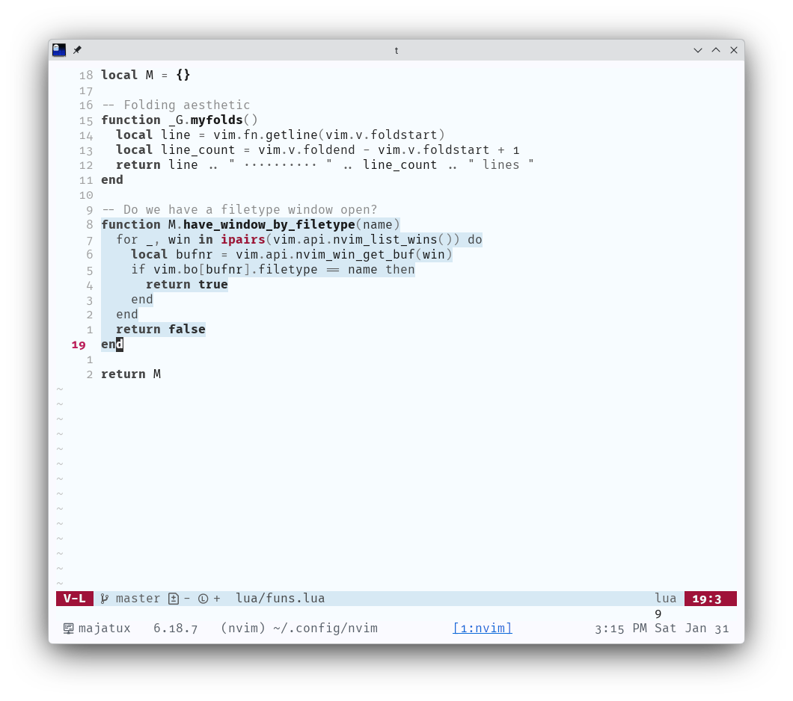

# litmus.nvim

A light colorscheme. Grayscale foundation, rose accents, blue-washed surfaces.

Requires [colorbuddy.nvim](https://github.com/tjdevries/colorbuddy.nvim).



## Install

```lua
-- lazy.nvim
{
  "majamin/litmus.nvim",
  dependencies = { "tjdevries/colorbuddy.nvim" },
  config = function()
    vim.cmd("colorscheme litmus")
  end,
}
```

## Palette

`litmus_0`–`litmus_9` runs black to white. The top two steps carry a blue wash. Two rose accents provide the only chromatic color outside diagnostics and diff.

```lua
require("litmus").colors()
```

Override before setup:

```lua
local litmus = require("litmus.nvim")
litmus.palette.primary = "#0369a1"
litmus.setup()
```

## License

[MIT](LICENSE)
